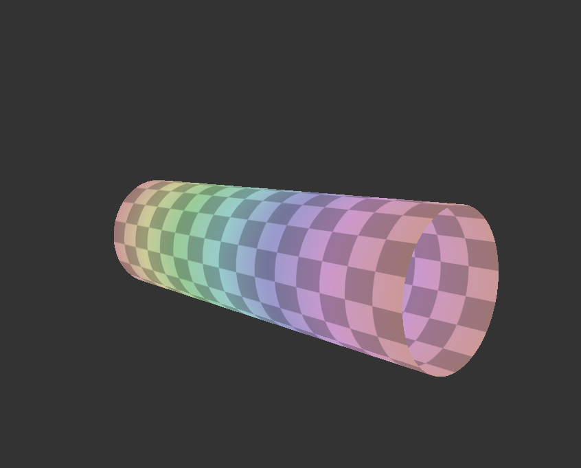
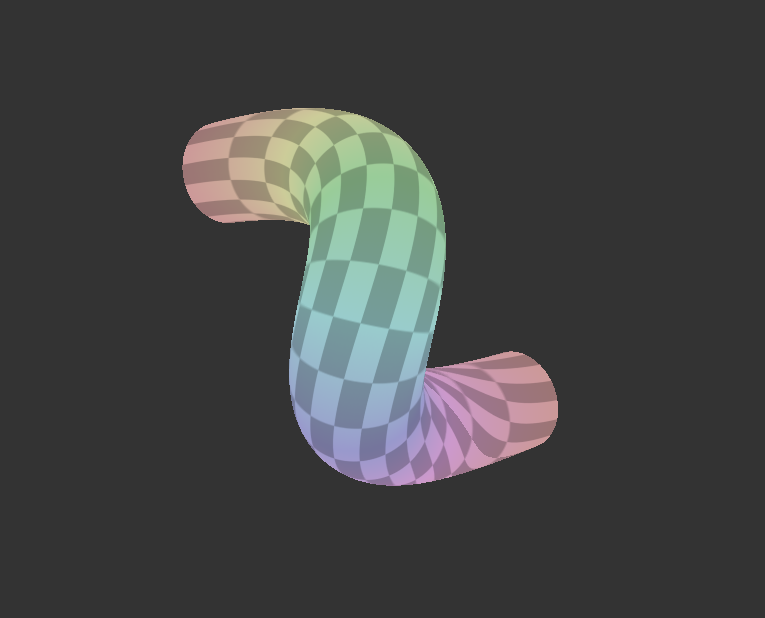
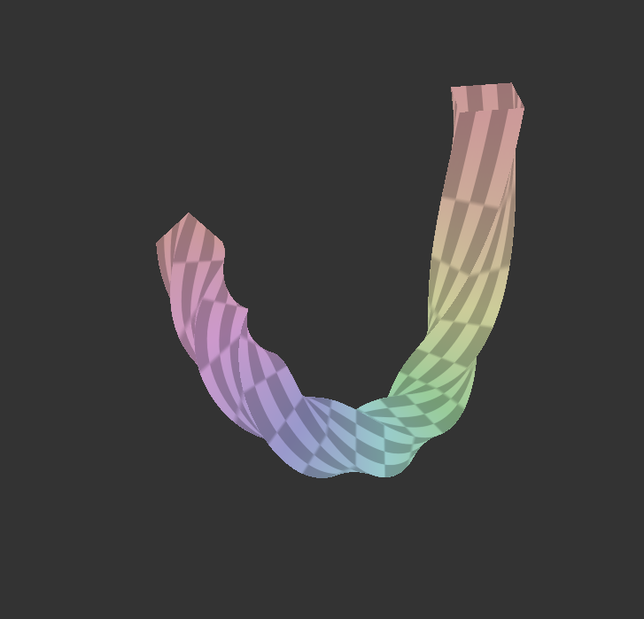

# Compte rendu TD8 - Marius Pardo

## Cylindre

L'implémentation du cylindre est fonctionnelle sur n'importe quel axe grâce au calcul d'un repère local qui permet d'effectuer une rotation du cercle de contrôle pour qu'il soit orthogonal à la tangente.

## Courbe de Bézier

L'implémentation de la courbe de bézier de degré 3 est également fonctionnelle, elle permet également d'extraire la tangente utilisé pour la construction du repère local.

## Courbe de Bézier - Torsion

La torsion d'une courbe de bézier avec une section carrée est fonctionnelle avec une variable uniforme permettant de contrôler la vitesse de torsion avec les flêches du haut et du bas.

## Calcul des normales

Non implémenté
